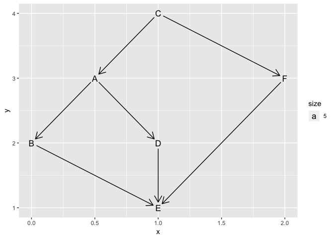

Day 7: The Sum of Its Parts
================
jenny
Sat Dec 8 15:46:56 2018

<https://adventofcode.com/2018/day/7>

``` r
library(tidygraph)
#> 
#> Attaching package: 'tidygraph'
#> The following object is masked from 'package:stats':
#> 
#>     filter
library(ggraph)
#> Loading required package: ggplot2

x <- scan(what = "", sep = "\n", text = "
Step C must be finished before step A can begin.
Step C must be finished before step F can begin.
Step A must be finished before step B can begin.
Step A must be finished before step D can begin.
Step B must be finished before step E can begin.
Step D must be finished before step E can begin.
Step F must be finished before step E can begin.
")

e <- stringr::str_extract_all(x, "(?<!^)[A-Z]", simplify = TRUE)
g <- as_tbl_graph(e)

## Designed for directed acyclic graphs (that is, hierarchies where multiple
## parents are allowed) it minimizes the number of crossing edges.
ggraph(g, layout = "sugiyama") +
  geom_node_text(aes(label = name, size = 5)) +
  geom_edge_link(arrow = arrow(length = unit(4, 'mm')),
                 start_cap = circle(3, 'mm'),
                 end_cap = circle(3, 'mm'))
```

<!-- -->
