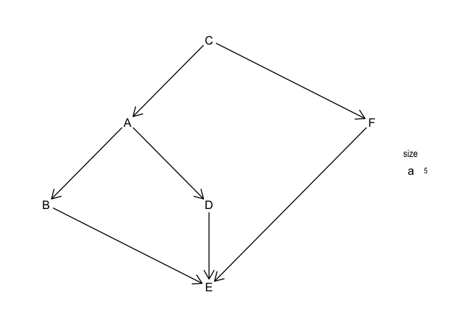
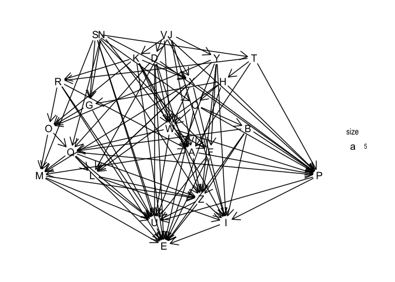

Day 7: The Sum of Its Parts
================
jenny
Sun Dec 9 09:42:58 2018

<https://adventofcode.com/2018/day/7>

Part 1

Good excuse to use tidygraph and ggraph a wee bit.

``` r
library(tidygraph)
#> 
#> Attaching package: 'tidygraph'
#> The following object is masked from 'package:stats':
#> 
#>     filter
library(ggraph)
#> Loading required package: ggplot2
library(tidyverse)
#> ── Attaching packages ─────────────────────────────────────────── tidyverse 1.2.1 ──
#> ✔ tibble  1.4.99.9006     ✔ purrr   0.2.5.9000 
#> ✔ tidyr   0.8.2           ✔ dplyr   0.7.99.9000
#> ✔ readr   1.2.1           ✔ stringr 1.3.1      
#> ✔ tibble  1.4.99.9006     ✔ forcats 0.3.0
#> ── Conflicts ────────────────────────────────────────────── tidyverse_conflicts() ──
#> ✖ dplyr::filter() masks tidygraph::filter(), stats::filter()
#> ✖ dplyr::lag()    masks stats::lag()
library(testthat)
#> 
#> Attaching package: 'testthat'
#> The following object is masked from 'package:dplyr':
#> 
#>     matches
#> The following object is masked from 'package:purrr':
#> 
#>     is_null
#> The following object is masked from 'package:tidygraph':
#> 
#>     matches

sugiyama <- function(g) {
  ## 'sugiyama' layout: "designed for directed acyclic graphs (that is,
  ## hierarchies where multiple parents are allowed) it minimizes the number of
  ## crossing edges"
  ggraph(g, layout = "sugiyama") +
    geom_node_text(aes(label = name, size = 5)) +
    geom_edge_link(arrow = arrow(length = unit(4, 'mm')),
                   start_cap = circle(3, 'mm'),
                   end_cap = circle(3, 'mm')) +
    theme_graph()
}

## input: tbl_graph
## output: named list, names are nodes names, componenets are node prereqs
get_prereqs <- function(g) {
  g %>%
  activate(nodes) %>%
  mutate(
    prereqs = local_members(mindist = 1, mode = "in"),
    prereqs = purrr::map(prereqs, ~ sort(name[.x]))
  ) %>%
  as_tibble() %>%
  deframe()
}

## remove node(s) from list or prereqs
remove_targets <- function(l, targets) lapply(l, function(z) z[!(z %in% targets)])

## nodes names where all prereqs are met and not 'used' yet
get_candidates <- function(l, pos) {
  names(l)[lengths(l) == 0 & pos > length(pos)]
}

## graph in, ordered node string out
steps <- function(g) {
  prereqs <- get_prereqs(g)
  n <- length(prereqs)
  pos <- setNames(rep(n + 1, n), names(prereqs))
  candidates <- get_candidates(prereqs, pos)
  i <- 1
  while(length(candidates) > 0) {
    target <- sort(candidates)[1]
    pos[target] <- i
    prereqs <- remove_targets(prereqs, target)
    candidates <- get_candidates(prereqs, pos)
    i <- i + 1
  }
  paste(names(sort(pos)), collapse = "")
}
```

example

``` r
ex <- scan(what = "", sep = "\n", text = "
Step C must be finished before step A can begin.
Step C must be finished before step F can begin.
Step A must be finished before step B can begin.
Step A must be finished before step D can begin.
Step B must be finished before step E can begin.
Step D must be finished before step E can begin.
Step F must be finished before step E can begin.
")

ex <- stringr::str_extract_all(ex, "(?<!^)[A-Z]", simplify = TRUE)
g_ex <- as_tbl_graph(ex)

sugiyama(g_ex)
```

<!-- -->

Reproduce example result

``` r
steps(g_ex)
#> [1] "CABDFE"

expect_identical(steps(g_ex), "CABDFE")
```

Work with my input

``` r
day7 <- scan("day07.txt", what = "", sep = "\n")
day7 <- stringr::str_extract_all(day7, "(?<!^)[A-Z]", simplify = TRUE)
g_day7 <- as_tbl_graph(day7)

sugiyama(g_day7)
```

<!-- -->

``` r

steps(g_day7)
#> [1] "JKNSTHCBGRVDXWAYFOQLMPZIUE"
```

Part 2, back to the example

In hindsight, I could probably unify parts 1 and 2 more, but I don’t
feel like it.

``` r
expired <- function(t) abs(t) < .Machine$double.eps

get_candidates2 <- function(l, timeleft) {
  sort(names(l)[lengths(l) == 0 & is.infinite(timeleft)])
}

part2 <- function(g, n_workers, offset = 0) {
  prereqs <- get_prereqs(g)
  n <- length(prereqs)
  durations <- setNames(seq_along(LETTERS), LETTERS) + offset
  timeleft <- setNames(rep(Inf, n), names(prereqs))

  t <- 0
  while(any(timeleft > 0)) {
    timeleft <- timeleft - 1

    ## nodes reaching completion
    candidates <- names(timeleft[expired(timeleft)])

    prereqs <- remove_targets(prereqs, candidates)

    ## start work on new nodes
    candidates <- get_candidates2(prereqs, timeleft)
    if (length(candidates) > 0) {
      n_in_process <- sum(timeleft > 0 & is.finite(timeleft))
      candidates <- head(candidates, n_workers - n_in_process)
      timeleft[candidates] <- durations[candidates]
    }

    t <- t + 1
  }


  return(list(
    string = paste(names(sort(timeleft)), collapse = ""),
    t = t - 1
  ))
}

(ans <- part2(g_ex, n_workers = 2, offset = 0))
#> $string
#> [1] "CABFDE"
#> 
#> $t
#> [1] 15
expect_identical(ans$string, "CABFDE")
expect_identical(ans$t, 15)

(ans <- part2(g_day7, n_workers = 5, offset = 60))
#> $string
#> [1] "JNSVKDYTXHRCGBOWAFQLMPZIUE"
#> 
#> $t
#> [1] 755
```
